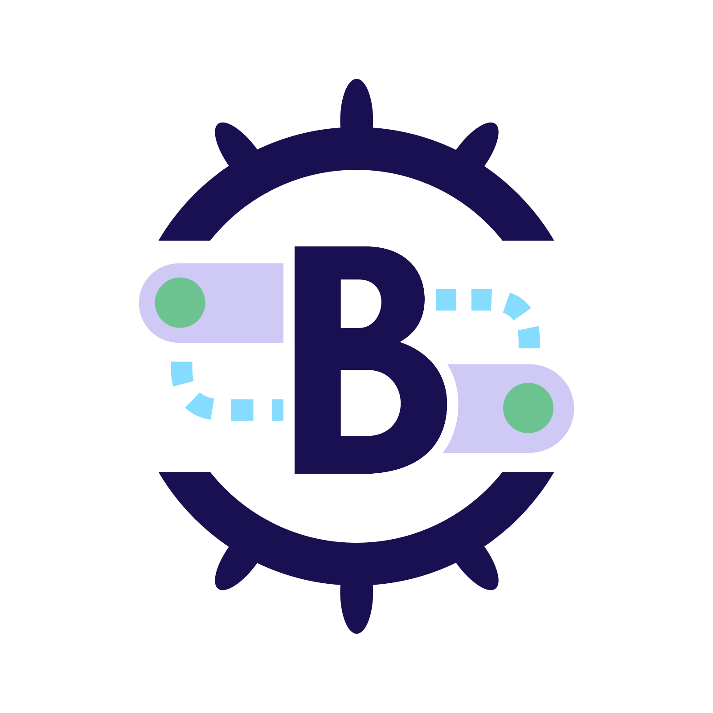
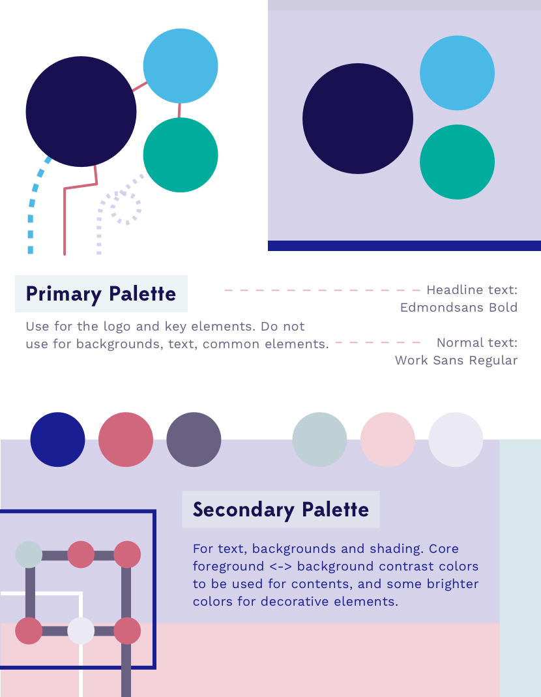
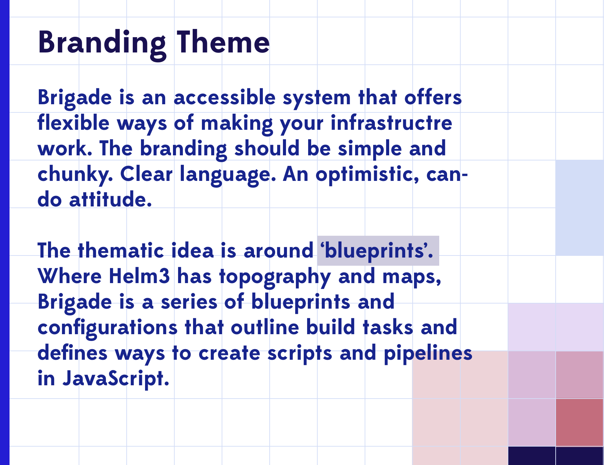
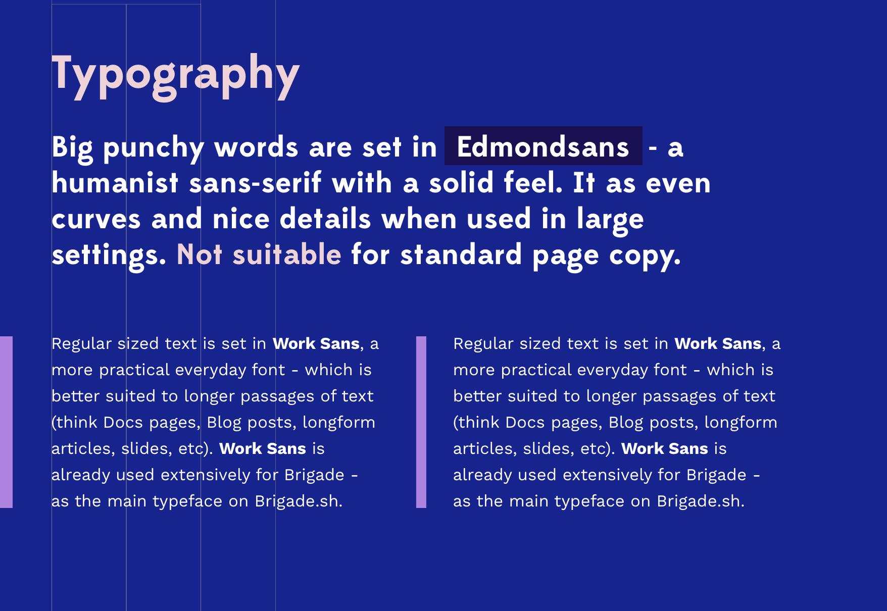

## Logo

The official Brigade logo is found at the [CNCF/artwork](https://github.com/cncf/artwork/blob/master/examples/sandbox.md#brigade-logos) repo.


_^ logo_



_^ icon_

# Brand Colors




### Color Values

```
// primary
navy           #0F1689

// secondary
blue-dark      #090E6F
blue-light     #1B53C2

// shades
shade-dark     #050843
shade-mid      #B7C2E9
shade-light    #DBE1F3

// accents
accent-blue    #3B82BF
accent-green   #2F84A7
accent-red     #95297C
accent-yellow  #D1AA9B
```



# Typography



* [Edmondsans](http://www.losttype.com/font/?name=edmondsans) _(James T Edmondson, [Licence](./typefaces/Edmondsans 5.pdf).)_
* [Work Sans](https://fonts.google.com/specimen/Work+Sans) _(Wei Huang, [Licence](https://fonts.google.com/specimen/Work+Sans#license))_
