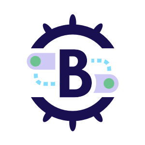

# Brigade Community

Welcome to the Brigade community!

This is the starting point for learning all about Brigade, how to become a
contributor, improve the docs or how to get started in giving a talk about
Brigade.

 

* [Core Project (v2)][repo]
* [Documentation (WIP v2 Refresh)][docs]
* [Logos](art)
* [Contributing](contributing.md)
* [Governance](governance.md)

## Communication

- Join us on the Kubernetes Slack, in the [#brigade][slack] channel]
- Join our bi-weekly community meeting -- now back from hiatus:
    - [Zoom][zoom]
    - [Schedule, agenda, and notes][meeting]

## Your first contribution

We're extremely excited you want to contribute to Brigade. Make sure to read our
[developer guide][dev-guide] for technical guidance and our
[contributing guide](contributing.md) for information about signing your
commits.

## Code of Conduct

Participation in the Brigade project is governed by the
[CNCF Code of Conduct][conduct].

[repo]: https://github.com/brigadecore/brigade/tree/v2
[docs]: https://v2--brigade-docs.netlify.app/
[slack]: https://kubernetes.slack.com/messages/C87MF1RFD/
[zoom]: https://us02web.zoom.us/j/8846897113
[meeting]: https://hackmd.io/KyyZMHyzSzGEiQY0ZHPqgw?view
[dev-guide]: https://v2--brigade-docs.netlify.app/topics/developers/
[conduct]: https://github.com/cncf/foundation/blob/master/code-of-conduct.md
